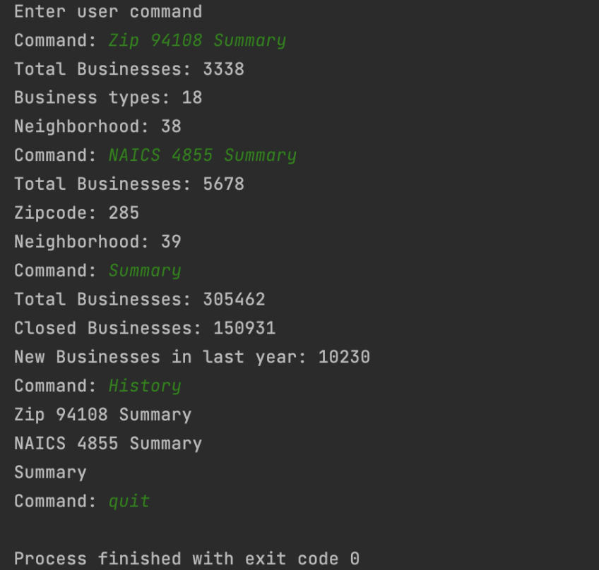

# Business-Analyzer

## Overview
The main goal is to work on lists in the collection framework in Java.The data Analyzer analyzes data from the dataset and answer queries given by the user about the data set.

  

## Main outline 
1. Classes ArrayList and LinkedList are implemented under the List Interface and Iterator Interface.
2. Class Entities defines the main fields used to process data and output the summary requested.
3. Classes DataReader and DataProcessor to store data in particular data structures.
4. Class CommandProcessor outputs the summary based on the user’s request.
5. Class BusinessAnalyzer receives args for file name and data structure and calls other classes to print summary.

## Run Time of Array List implementation vs linked list implementation
1. AL implementation roughly takes around a minute or two to run and print out summary. The time complexity is O(1).
2. LL implementation takes longer - approximately 12 minutes to run each command and print out summary. The time complexity is O(n).
3. LL takes a lot longer than AL since it needs more time to traverse the list node by node and there is frequent insertion of elements.
